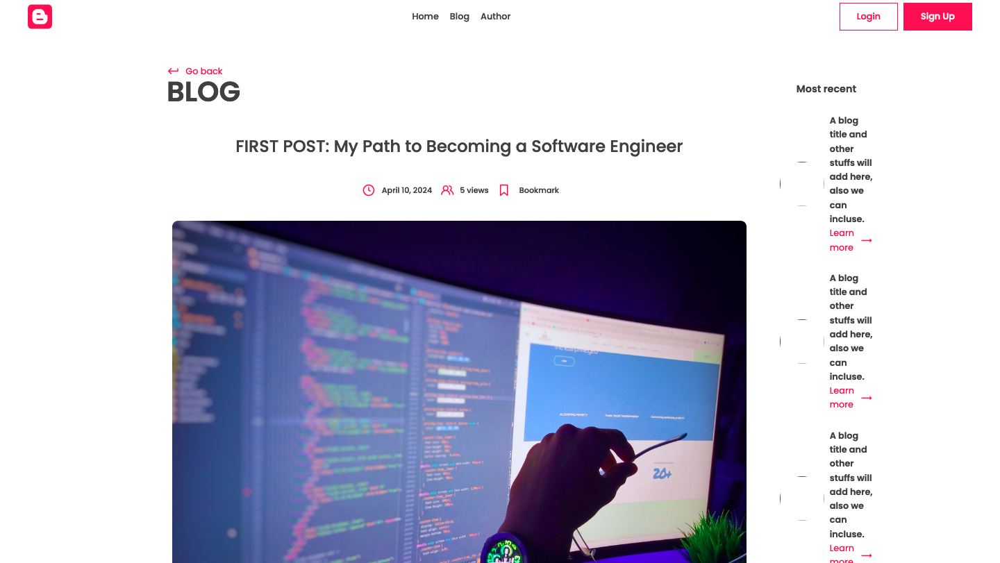
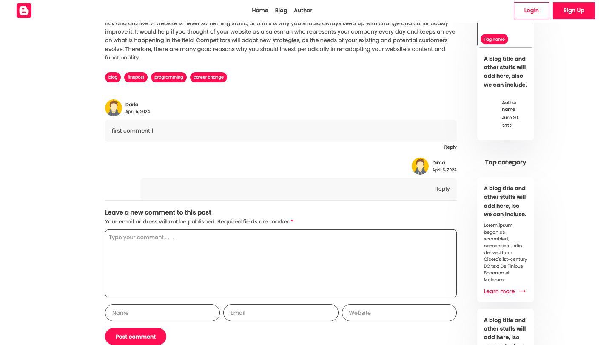
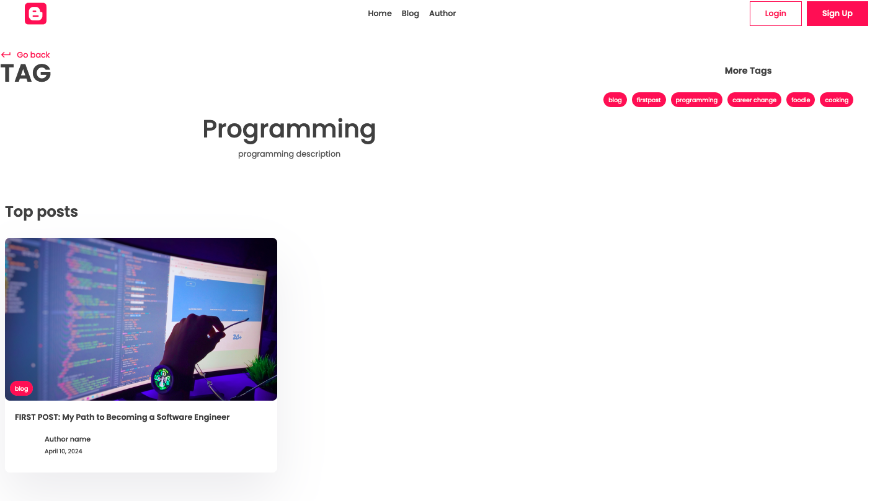

# Blog App

Note: This app is under active development

## Features
- The home page displays features of top and recent posts on the blog
- Authentication functionality of login, logout, signup and robust validation
- Post page with various elements such as tags, likes, comments, and bookmarking a particular post
- Comment system allows a user to leave a comment and reply to that particular comment
- Dedicated page for tags and authors
- Personalize experience based on user behavior
- Allow users to search on the website

## Technologies
- Python
- Django
- Docker
- AWS(ECS, RDS)
- Postgres

## Demo
**Home page of blog post showing top and featured posts**


**Post page displays the photo and blog post**


**Comment on a blog post and reply**


**Clicking on a tag of a post and navigating to posts assicated with the tag**


## Prerequisites
- Docker
- Make command

#### Steps
1. Clone the repo
2. Navigate to the repo directory
3. Run make build to build Docker images
4. Run make up
5. Navigate to http://0.0.0.0:8000

#### Make Commands
```shell
make build          Build containers
make up             Start containers
make down           Stop local dev environment
make restart        Down and up. Restart all containers
make sh, shell      Open shell into the app container
make db-shell       Open shell into DB container
make test           Run tests inside the container
make logs           Output container logs
make migrations     Create DB migration files
make migrate        Applies the changes recorded in migration files to the DB
```

## Deployment
Currently deployed manually in AWS ECS. DB is an RDS service.
Automated deployment TBD after Terraform is implemented
